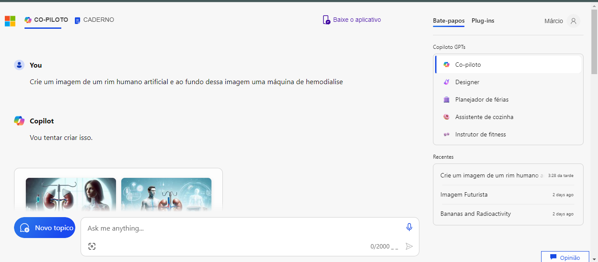
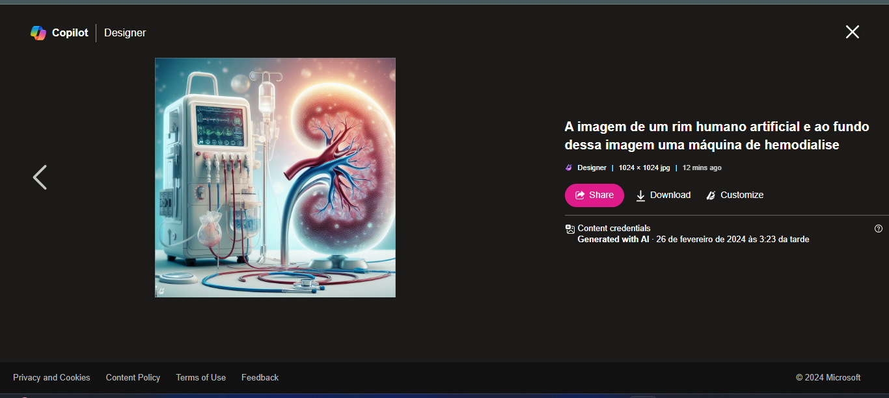

# EXPLORANDO OS RECURSOS DE IA GENERATIVA COM COPILOT E OPENAI #

Neste laboratório iremos aprender sobre as capacidades e aplicaçoes de IA generativa, destacando o uso do <b>Copilot e OpenAI</b>. Exploraremos como essas ferramentas podem auxiliar na criação de código, geração de texto e muito mais. Vamos abordar técnicas avançadas de utilização e compreensão dessas tecnologias para maximizar sua eficácia em diferentes contextos. Além disso, discutiremos ética e melhores práticas ao integrar IA generativa em projetos reais.
Neste laboratório pedimos ao <b>Copilot</b> que criasse uma imagem de um rim artificial humano com uma máquina de hemodiálise ao fundo.

## Rim Artificial criado pelo Copilot ##

Um rim artificial humano criado por IA é um avanço revolucionário na medicina, oferecendo soluções para a escassez de órgãos doadores e melhorando a qualidade de vidade de pacientes com doença renal crônica. Essa tecnologia combina algoritmos de inteligência artificial para replicar com precisão as funções renais, promovendo uma abordagem inovadora para o tratamento da insuficiência renal.

## Resultado Da Análise de Texto ##

O resultado é uma imagem surpreendente e única, gerada com base nas instruções e no contexto fornecidos, demonstrando a capacidade da IA generativa em criar arte visualmente impressionante.

## O Que Aprendi Com Esse Laboratório ##
<ol>
    <li>Compreensão das capacidades de IA generativa fornecidas pelo <b>Copilot e OpenAI</b>.</li>
    <li>Aplicações práticas dessas ferramentas, como geração de código, texto e outras formas de conteúdo.</li>
    <li>Técnicas avançadas para maximizar a eficácia dessas tecnologias em diferentes contextos, como projetos de programação e criação de conteúdo.</li>
    <li>Considerações éticas e melhores práticas ao integrar IA generativa em projetos reais, incluindo questões de propriedade intelctual e uso responsável.</li>
    <li>Exploração de como a inteligência artificial colaborativa pode transformar e otimizar processos de trabalho em várias áreas, impulsionando inovação e a eficiência.</li>
</ol>

